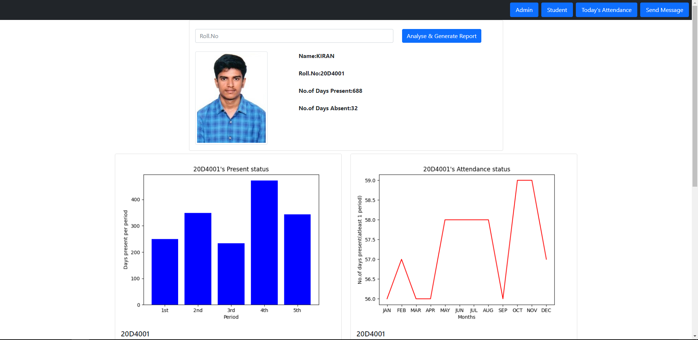

# Attendance System using Face Recognition adhered with message Automation supported by postgreSQL in python(web app)

   This project solves the problem of manual attendance marking. This replaces the traditional way of attendance system i.e paper and pen method and leverages the current technology to solve the problem in more intuitive way using python.

## Pre-requisites

 - Flask (micro web framework)
 - Python (programming language)
 - PostgresSQL (database)
 - Selenium (automation tool)
 - Bootstrap (css framework)
 - Browser (Chrome,Firefox..etc)
 - Web camera
 
 ## How to run the project?

>**Note:** All the uploaded images of a student are stored inside ***static/uploads***

 ### Step 1: Create the STUDENTS and ATTENDANCE table in postgreSQL
 

> **STUDENTS table**
> 
        CREATE TABLE IF NOT EXISTS students
    (
        roll character varying(20)  NOT NULL,
        sname character varying(40)  NOT NULL,
        dept character varying(40)  NOT NULL,
        contact character varying(40)  NOT NULL,
        image character varying(20) NOT NULL,
        CONSTRAINT students_pkey PRIMARY KEY (roll),
        CONSTRAINT students_image_key UNIQUE (image)
    )

> **ATTENDANCE table**
> 
    

        CREATE TABLE IF NOT EXISTS attendance
    (
        roll character varying(20)  NOT NULL,
        date character varying(20) NOT NULL,
        p1 character varying(10)  DEFAULT 'A',
        p2 character varying(10) DEFAULT 'A',
        p3 character varying(10)  DEFAULT 'A',
        p4 character varying(10)  DEFAULT 'A',
        p5 character varying(10) " DEFAULT 'A',
        CONSTRAINT attendance_pkey PRIMARY KEY (roll, date)
    )

 ### Step 2:
    run app.py
 ### Step 3:
    Go to the Browser and enter the LOCALHOST address 

>  http://127.0.0.1:5000/

## OUTPUT

